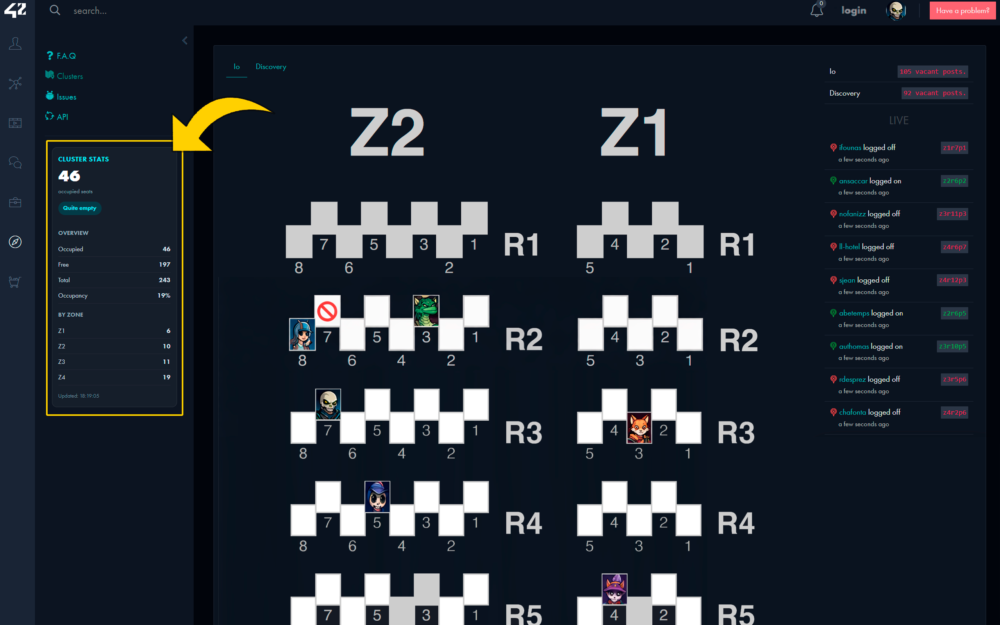

# 42 Cluster Stats 📊
[🌐 Chrome Web Store](https://chromewebstore.google.com/detail/aggohbfeoehknnidmbcikjgapbaahoeg?utm_source=item-share-cb)



A browser extension for the **42 intra** that displays live cluster occupancy statistics in the sidebar on the clusters page.

It currently provides a clean stats card with real-time occupancy data, crowd level indicators, per-zone breakdown, and automatic refresh.

---

## ✨ Features

* Live display of occupied seats across all zones
* Crowd level indicator (Empty, Light, Moderate, Busy, Very Busy)
* Overview statistics:

  * Occupied seats
  * Free seats
  * Total capacity
  * Occupancy percentage
* Per-zone breakdown of active users
* Auto-refresh every 30 seconds
* SPA navigation support with mutation observer
* Light, unobtrusive UI that matches the 42 intra style

---

## 🖼️ Overview

`42 Cluster Stats` enhances the 42 intra clusters page with a floating stats card in the sidebar.

The extension is designed to make it easier to:

* see current cluster occupancy at a glance
* understand crowd levels before heading to a cluster
* track which zones are busiest
* monitor seat availability in real-time

---

## 📦 Installation

### Chrome / Chromium-based browsers

1. Clone or download this repository

2. Install dependencies:

   ```bash
   npm install
   ```

3. Build the extension:

   ```bash
   npm run build
   ```

4. Open:

   ```text
   chrome://extensions
   ```

5. Enable **Developer mode**

6. Click **Load unpacked**

7. Select the `build/` folder

8. Open the 42 intra clusters page and use the extension

### Firefox

1. Follow steps 1-3 above

2. Open:

   ```text
   about:debugging#/runtime/this-firefox
   ```

3. Click **Load Temporary Add-on**

4. Select `build/manifest.json`

---

## 🚀 Development

Install dependencies:

```bash
npm install
```

Run a production build:

```bash
npm run build
```

Run in watch mode:

```bash
npm run watch
```

### Local workflow

1. Edit the source files
2. Run `npm run build` or `npm run watch`
3. Reload the extension in your browser
4. Test the updated version on the 42 intra clusters page

---

## 🏗️ Build Output

The final extension package is generated in:

```text
build/
```

This folder contains the full unpacked extension package, including:

* `manifest.json`
* built scripts
* icons
* inlined CSS styles

Use the `build/` folder for:

* local unpacked loading
* release packaging
* store upload preparation

---

## 🧩 Project Structure

```text
42-cluster-stats/
├── build/              # Final built extension package
├── icons/              # Extension icons
├── src/
│   └── content/
│       ├── index.js        # Entry point, bootstrap, refresh logic
│       ├── constants.js    # DOM IDs, API URLs, timing config
│       ├── api.js          # Cluster data fetching
│       ├── utils.js        # Pure utilities (escape, sleep, format)
│       ├── stats.js        # Stats computation (parse, build, labels)
│       ├── page.js         # Page detection, vacant count extraction
│       └── ui/
│           ├── sidebar-root.js  # Root element creation
│           ├── render.js        # Loading, error, stats rendering
│           └── styles.css       # All CSS styles
├── manifest.json       # Source manifest
├── build.js            # Build script
├── package.json
└── README.md
```

> The exact internal source structure may evolve as the extension grows.

---

## 🔐 Permissions

The extension uses minimal permissions:

* Host permission for `meta.intra.42.fr` to access cluster data
* No storage or external requests required

---

## 🛠️ Technical Notes

* Built with plain JavaScript (no frameworks)
* Uses Manifest V3
* CSS is inlined during build for single-file deployment
* Supports both Chrome/Edge and Firefox
* Guards against duplicate initialization
* HTML content is escaped to prevent XSS

---

## 📌 Notes

* The extension is intended for use on the **42 intra clusters page**
* The unpacked development version should be loaded from the `build/` folder, not from the project root
* After making changes, remember to reload the extension in the browser
* Data refreshes automatically every 30 seconds

---

## 🤝 Contributing

Suggestions, improvements, and feedback are welcome.

If you want to improve the extension:

* fork the repository
* make your changes
* test them on the 42 intra
* open a pull request
